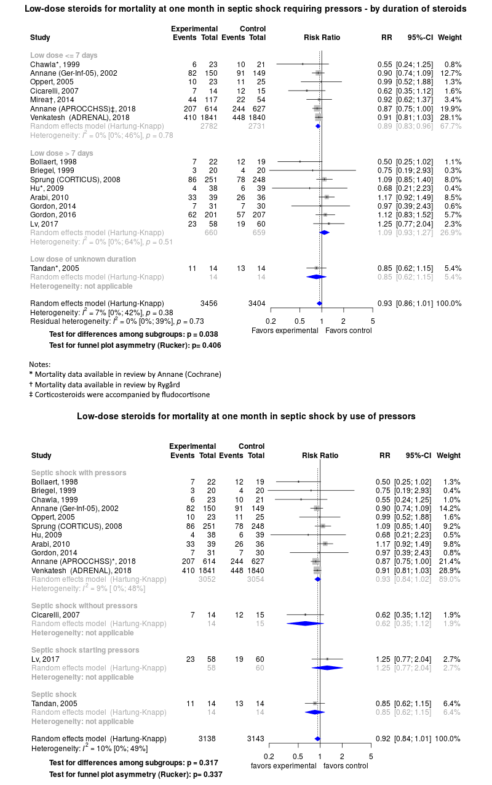

# Sepsis (severe sepsis or septic shock) treatment with corticosteroids

A living systematic review

Short url: http://openmetaanalysis.github.io/sepsis-steroids

**Clinical summary:** This meta-analysis suggests that low dose corticosteroids in patients with septic shock who are hypotensive despite pressors *may be* effective at reducing mortality. While the Cochrane Collaboration (citation below) found significant benefit among all patients with septic shock, the Cochrane used Mantel-Haenszel fixed estimator. This method may be too optimistic because the heterogenteity as measured by I2 was '[moderate](http://handbook.cochrane.org/chapter_9/9_5_2_identifying_and_measuring_heterogeneity.htm)' at 57%. In this setting the Knapp-Hartung estimator may be better.(PMID: [24727843](https://pubmed.gov/24727843) )

The benefit among vasopressor-dependent patients does not depend on their adrenal status or co-administration of fludrocortisone (see [additional forest plots](files/forest-plots))

Meta-regression dooes not find modulators (year of publication, study size, event rate in the control groups) on the effect of the intervention.

* [Reconciliation of conclusions with prior meta-analyses](files/reconciliation-tables/Reconciliation%20of%20conclusions.pdf)
* [Keep current with this topic](Keep-up.md)

Acknowledgement: we acknowledge the essential work by the authors of the prior systematic review(s) listed below.

**Methods overview:** This repository is an [openMetaAnalysis](https://openmetaanalysis.github.io/) that combines methods of scoping, rapid, and living systematic reviews.  This analysis updates one or more previously published review(s).(1) A comparison of studies include in this review compared to prior reviews are in the table, [reconciliation of trials included with prior meta-analyses](files/reconciliation-tables/Reconciliation%20of%20studies.pdf). Newer studies included are listed in the references below. Rationale for newer trials excluded may be listed at the end of the references. 
* [Methods](http://openmetaanalysis.github.io/methods.html) for openMetaAnalysis
* [Evidence search](files/searching/evidence-search.md) for this review

**Results:** Details of the studies included are in the:
* [Description of studies (PICO table)](files/study-details/pico-table.md) (not available)
* [Risk of bias assessment](files//study-details/risk-of-bias.md) (not available)
* [Forest plots](files//forest-plots) ([source data](files/data))
* [Meta-regressions](files//metaregression) ([source data](files/data))
* [Reconciliation of conclusions and trials included with prior meta-analyses](files/reconcilation-tables)

The forest plot for the primary outcomes are below. Additional [forest plots](files/forest-plots) of secondary analyses may be available. 

The meta-regression for the primary outcomes are below. Additional [meta-regressions](files/metaregression) of secondary analyses may be available. 

References:
----------------------------------
### Systematic review(s)
#### Most recent review(s) at time of last revision of this repository
1. Gibbison B, López-López JA, Higgins JP, Miller T, Angelini GD, Lightman SL, Annane D. Corticosteroids in septic shock: a systematic review and network meta-analysis. Crit Care. 2017 Mar 28;21(1):78. doi: [10.1186/s13054-017-1659-4](http://dx.doi.org/10.1186/s13054-017-1659-4). PMID: [28351429](http://pubmed.gov/28351429); PMCID: [PMC5371269](https://www.ncbi.nlm.nih.gov/pmc/articles/PMC5371269/)
2. Volbeda M, Wetterslev J, Gluud C, Zijlstra JG, van der Horst IC, Keus F. Glucocorticosteroids for sepsis: systematic review with meta-analysis and trial sequential analysis. Intensive Care Med. 2015 Jul;41(7):1220-34. doi: [10.1007/s00134-015-3899-6](http://dx.doi.org/10.1007/s00134-015-3899-6). PMID: [26100123](http://pubmed.gov/26100123); PMCID: [PMC4483251](https://www.ncbi.nlm.nih.gov/pmc/articles/PMC4483251/)
3. Annane D, Bellissant E, Bollaert PE, Briegel J, Keh D, Kupfer Y. Corticosteroids for treating sepsis. Cochrane Database Syst Rev. 2015 Dec 3;(12):CD002243. doi: [10.1002/14651858.CD002243.pub3](http://dx.doi.org/10.1002/14651858.CD002243.pub3). PMID: [26633262](http://pubmed.gov/26633262)

### Randomized controlled trials that are more recent
1. 1: Keh D, Trips E, Marx G, Wirtz SP, Abduljawwad E, Bercker S, et al; SepNet–Critical Care Trials Group.. Effect of Hydrocortisone on Development of Shock Among Patients With Severe Sepsis: The HYPRESS Randomized Clinical Trial. JAMA. 2016 Nov 1;316(17):1775-1785. doi: [10.1001/jama.2016.14799](http://dx.doi.org/10.1001/jama.2016.14799). PMID: [27695824](http://pubmed.gov/27695824).

#### New study(s) undergoing review
1. Lv QQ, Gu XH, Chen QH, Yu JQ, Zheng RQ. Early initiation of low-dose hydrocortisone treatment for septic shock in adults: A randomized clinical trial. Am J Emerg Med. 2017 Jun 5. pii: S0735-6757(17)30444-8. doi: 10.1016/j.ajem.2017.06.004. PMID: [28615145](http://pubmed.gov/28615145)
2. Annane D, Renault A, Brun-Buisson C, Megarbane B, Quenot JP, Siami S, Cariou A, Forceville X, Schwebel C, Martin C, Timsit JF, Misset B, Ali Benali M, Colin G, Souweine B, Asehnoune K, Mercier E, Chimot L, Charpentier C, François B, Boulain T, Petitpas F, Constantin JM, Dhonneur G, Baudin F, Combes A, Bohé J, Loriferne JF, Amathieu R, Cook F, Slama M, Leroy O, Capellier G, Dargent A, Hissem T, Maxime V, Bellissant E; CRICS-TRIGGERSEP Network. Hydrocortisone plus Fludrocortisone for Adults with Septic Shock. N Engl J Med. 2018 Mar
1;378(9):809-818. doi: 10.1056/NEJMoa1705716. PMID: [29490185](http://pubmed.gov/29490185)
3. Venkatesh B, Finfer S, Cohen J, Rajbhandari D, Arabi Y, Bellomo R, Billot L, Correa M, Glass P, Harward M, Joyce C, Li Q, McArthur C, Perner A, Rhodes A, Thompson K, Webb S, Myburgh J; ADRENAL Trial Investigators and the Australian–New Zealand Intensive Care Society Clinical Trials Group. Adjunctive Glucocorticoid Therapy in Patients with Septic Shock. N Engl J Med. 2018 Mar 1;378(9):797-808. doi: 10.1056/NEJMoa1705835. Epub 2018 Jan 19. PMID: [29347874](http://pubmed.gov/29347874)

#### New study(s) *excluded* 
None

-------------------------------
[Cite and use this content](https://github.com/openMetaAnalysis/openMetaAnalysis.github.io/blob/master/reusing.MD)  - [Edit this page](../../edit/master/README.md) - [History](../../commits/master/README.md)  - 
[Issues and comments](../../issues?q=is%3Aboth+is%3Aissue)

